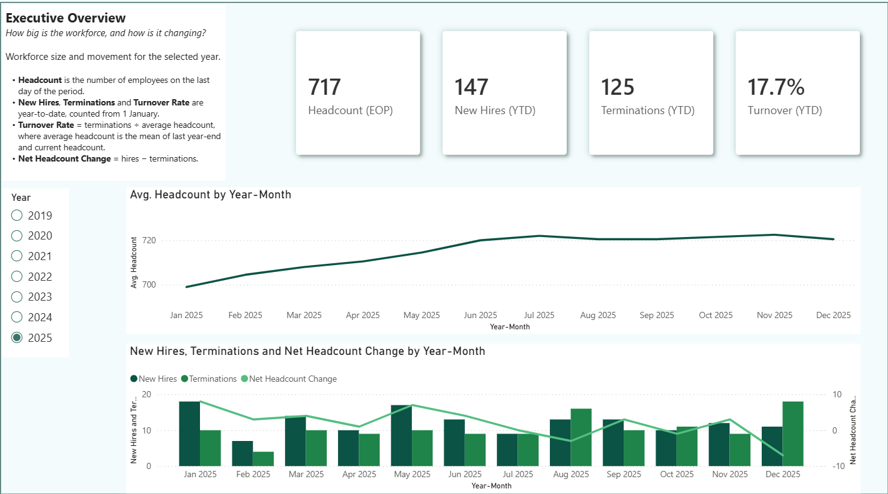
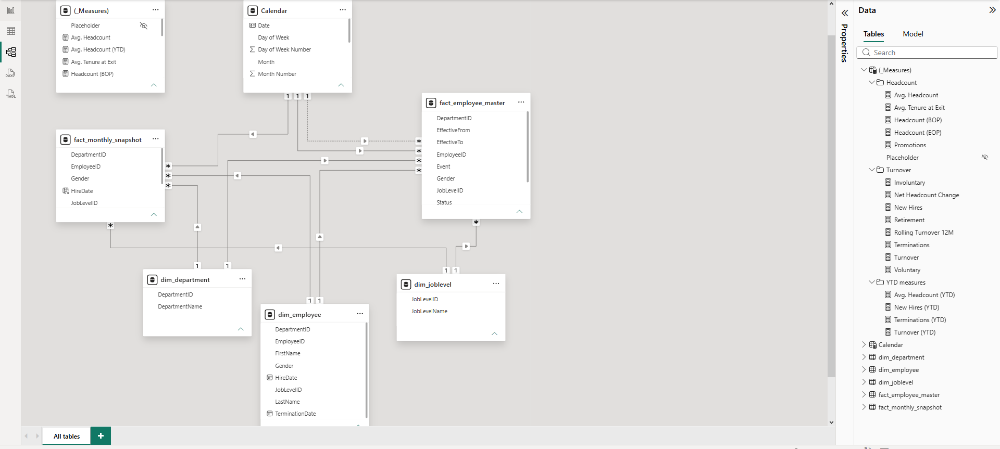
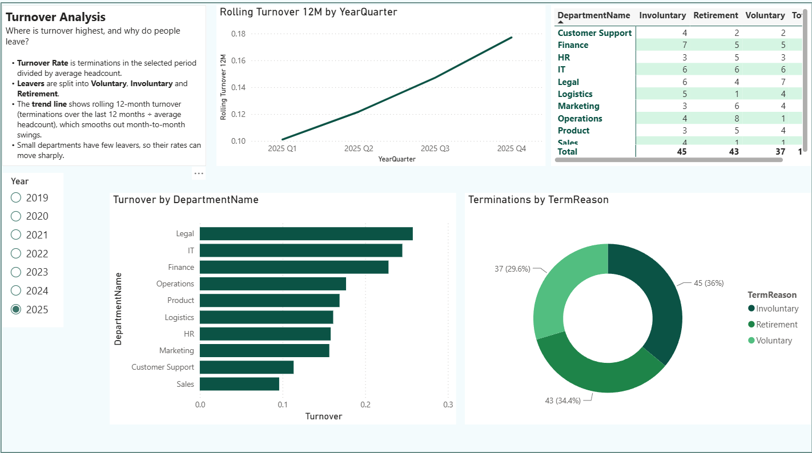
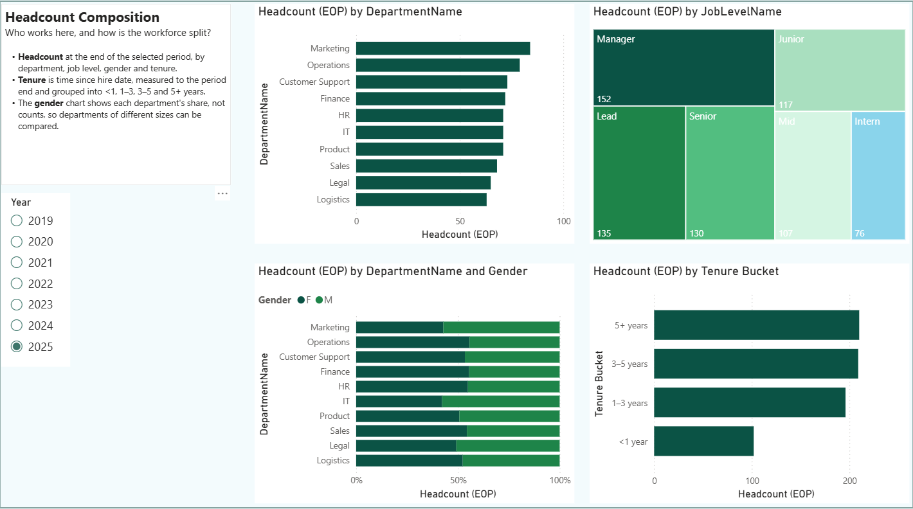
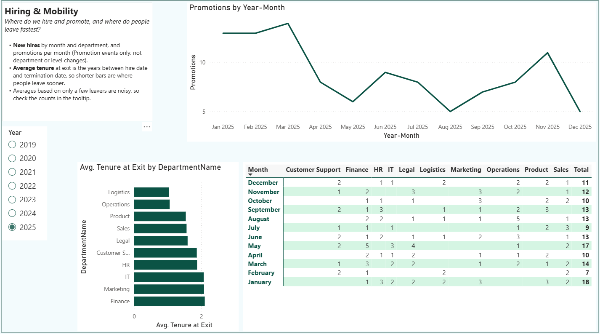

# HR Headcount & Turnover Dashboard

A Python ETL pipeline and a four-page Power BI report that answer core people-analytics questions: how big is the workforce, how fast is it changing, where do people leave, and who works here.

> **All data in this repository is synthetic.** It was generated for demonstration and contains no real employees.



---

## Contents

1. [Business questions](#business-questions)
2. [Repository structure](#repository-structure)
3. [ETL (Python)](#etl-python)
4. [Power BI data model](#power-bi-data-model)
5. [Measures and definitions](#measures-and-definitions)
6. [Report pages](#report-pages)
7. [Design decisions and lessons learned](#design-decisions-and-lessons-learned)
8. [Validation](#validation)
9. [Assumptions and limitations](#assumptions-and-limitations)
10. [How to run this project](#how-to-run-this-project)
11. [AI assistance](#ai-assistance)
12. [License.md](#license)

---

## Business questions

| Page | Question | Main visuals |
|---|---|---|
| 1. Executive Overview | How big is the workforce and how is it changing? | Headcount, hires, terminations and turnover cards; headcount trend; hires vs terminations with net change |
| 2. Turnover Analysis | Where is turnover highest, and why do people leave? | Turnover by department, voluntary / involuntary / retirement split, rolling 12-month trend, department x reason table |
| 3. Headcount Composition | Who works here? | Headcount by department, job level, gender share by department, tenure band |
| 4. Hiring & Mobility | Where do we hire and promote, and where do people leave fastest? | Hires by month and department, promotions over time, average tenure at exit by department |

---

## Repository structure

```
.
├── config/                        # Power BI theme files (JSON): colours and card styling
├── data/
│   ├── *.csv                      # source tables (dim_* and fact_* files)
│   ├── output/                    # generated by employee_master.py
│   │   ├── employee_master.csv
│   │   └── monthly_snapshot.csv
│   └── logs/                      # run log and data-quality extracts (not committed)
├── docs/
│   ├── DAX_measures.md           # all measures and calculated columns
│   └── images/                    # screenshots used in this README
├── employee_master.py             # ETL script
├── requirements.txt
├── HR dashboard.pbix              # Power BI report (single file)
├── HR dashboard.pbip              # same report as a Power BI Project (text-based, diff-friendly)
├── HR dashboard.Report/           # report definition (pages, visuals)
├── HR dashboard.SemanticModel/    # data model (tables, relationships, measures)
└── LICENSE.md
```

The `.pbip` project sits next to the `.pbix` so the model and measures can be reviewed directly on GitHub. The theme JSON files in `config/` were generated with Copilot and control the colour palette and card styling.

---

## ETL (Python)

`employee_master.py` (pandas) turns the raw source tables into two analysis-ready tables. It resolves all paths relative to its own location, so it runs from any working directory.

### Inputs (`data/`)

| File | Content |
|---|---|
| `fact_hires.csv` | one hire event per employee (hire date, department) |
| `fact_terminations.csv` | termination date and reason (Voluntary, Involuntary, Retirement) |
| `fact_statuschanges.csv` | department changes, job-level changes and promotions |
| `dim_employee.csv` | employee attributes: gender, job level, hire and termination dates |

`dim_department.csv` and `dim_joblevel.csv` are not used by the script; they are loaded straight into the Power BI model.

### Outputs (`data/output/`)

| File | Grain | Purpose |
|---|---|---|
| `employee_master.csv` | one row per employee **event** | Flows: hires, terminations and promotions counted by date. Each row has `EffectiveFrom` / `EffectiveTo` (slowly-changing-dimension style; open rows end on `9999-12-31`), department, job level, gender and `Status` (Active / Inactive). Events: Hire, DepartmentChange, JobLevelChange, Promotion, Termination: Voluntary / Involuntary / Retirement. |
| `monthly_snapshot.csv` | one row per employee **per month-end** (Jan 2019 - Dec 2025) | Stocks: headcount, composition and tenure at a point in time. Columns: EmployeeID, DepartmentID, Gender, JobLevelID, MonthEnd. |

### Why two tables (stocks vs flows)

- **Headcount is a stock.** It can only be read at a moment in time (the end of a period) and cannot be summed across months. It comes from the monthly snapshot.
- **Hires, terminations and promotions are flows.** They can be summed across any period. They come from the event table, dated by `EffectiveFrom`.

Using the wrong table for a measure is the most common way HR dashboards produce numbers that look plausible but are wrong.

### Pipeline steps

1. **Load** the four source files with encoding fallbacks and clear errors for missing or empty files. Start an append-mode log (`data/logs/data_quality_log.txt`).
2. **Clean:** exclude employees hired and terminated on the same day, and drop status-change events dated after an employee's termination.
3. **Build the event table:** one Hire row per employee (with gender and job level from `dim_employee`), then append department changes, promotions and job-level changes, and termination rows labelled `Termination: <reason>`.
4. **Derive validity ranges:** sort each employee's events by date, set `EffectiveTo` to the day before the next event, and forward-fill gender, department and job level within each employee. The termination row is marked `Inactive` and closes the record; open records end on `9999-12-31`.
5. **Validate:** flag promotions that do not change job level, department changes to the same department, job-level decreases (possible demotions), events before the hire date (dropped), invalid effective ranges and rehires.
6. **Write** `employee_master.csv`.
7. **Build the snapshot:** cross-join every employee with every month-end from 2019-01-31 to 2025-12-31, keep the active record that covers each month-end (the latest event wins), and write `monthly_snapshot.csv`. An employee whose termination date is that month-end is not counted, so the snapshot agrees with the terminations counted in the same month.

### Data-quality checks

Each check writes a summary line to `data_quality_log.txt` and, when it finds rows, an extract CSV to `data/logs/`.

| Check | Action |
|---|---|
| Hired and terminated the same day | employee excluded from hires and terminations |
| Status-change event after termination | event dropped |
| Promotion that does not change job level | logged |
| Department change to the same department | logged |
| Job-level decrease (possible demotion) | logged |
| Event dated before the hire date | dropped |
| `EffectiveFrom` later than `EffectiveTo` | logged |
| Rehire (duplicate hire for one employee) | logged; rehires are not supported |

In this dataset the same-day check excludes one of the 1,000 employees in `dim_employee` (hired and terminated on 2025-12-23), which is why the analysis covers 999 employees and 282 terminations while `dim_employee` holds 283 termination dates.

---

## Power BI data model



| Table | Type | Notes |
|---|---|---|
| `fact_employee_master` | fact (events) | Calendar relationship on `EffectiveFrom` (**active**). A relationship on `EffectiveTo` exists but is **inactive**. |
| `fact_monthly_snapshot` | fact (month-end roster) | Calendar relationship on `MonthEnd`. |
| `Calendar` | date table | Marked as date table, full years 2019-2025, with `Year`, `YearMonth` and `YearQuarter` columns. |
| `dim_department`, `dim_joblevel`, `dim_employee` | dimensions | One-to-many into the fact tables. |
| `_Measures` | measure table | All measures, grouped in display folders (Headcount, Turnover, YTD measures). |

Calculated columns (see [`docs/DAX_measures.md`](docs/DAX_measures.md)):

- `fact_employee_master[TenureAtExitYrs]`: years from hire date to termination date (termination rows only).
- `fact_monthly_snapshot[TenureBand]` and its sort column: tenure at each month-end, banded into <1, 1-3, 3-5 and 5+ years.

---

## Measures and definitions

| Measure | Definition |
|---|---|
| Headcount (EOP) | Employees on the last month-end of the selected period (from the snapshot). |
| Headcount (BOP) | Employees at the end of the month before the first day of the selected period. |
| Avg. Headcount | (BOP + EOP) / 2 |
| New Hires, Terminations, Promotions | Count of the matching events in the selected period. |
| Involuntary, Voluntary, Retirement | Terminations by reason. |
| Net Headcount Change | New Hires - Terminations |
| Turnover | Terminations / Avg. Headcount for the selected period |
| New Hires (YTD), Terminations (YTD) | Events from 1 January to the end of the selected period |
| Avg. Headcount (YTD) | (prior year-end headcount + current EOP) / 2 |
| Turnover (YTD) | Terminations (YTD) / Avg. Headcount (YTD) |
| Rolling Turnover 12M | Terminations in the last 12 months / average headcount over the same window (an annual rate) |
| Avg. Tenure at Exit | Average years from hire to termination |

Turnover follows the standard HR definition: separations divided by average headcount, where average headcount is the mean of headcount at the start and end of the period. The full DAX is in [`docs/DAX_measures.md`](docs/DAX_measures.md).

---

## Report pages

Use the Year slicer (single select) on every page.

### 1. Executive Overview


Workforce size and movement for the selected year. Headcount is the number of employees on the last day of the period. New Hires, Terminations and Turnover are year-to-date. Net Headcount Change = hires - terminations.

### 2. Turnover Analysis



Turnover by department, split by reason (voluntary, involuntary, retirement), with a rolling 12-month trend that smooths month-to-month swings. Small departments have few leavers, so their rates can move sharply.

### 3. Headcount Composition



Headcount at the end of the selected period by department, job level, gender share and tenure band. Tenure is measured from hire date to the period end.

### 4. Hiring & Mobility



Hires by month and department, promotions per month (Promotion events only), and average tenure at exit by department. Averages based on a few leavers are noisy, so check the counts in the tooltip.

---

## Design decisions and lessons learned

- **Stocks and flows come from different tables** (see ETL). Headcount visuals use the snapshot; hires, terminations and promotions use the event table.
- **`CALCULATE` filters replace existing filters on the same column.** A matrix with `Event` on the columns showed every column equal to total terminations, because the measure's own filter on `Event` overwrote the matrix's. The count measures use `KEEPFILTERS` so an `Event` field on a visual still filters them.
- **YTD and rolling measures use explicit date bounds** (with `REMOVEFILTERS` on Calendar where needed), so they behave the same on a monthly axis, a quarterly axis and a slicer selection.
- **The turnover denominator covers the same window as the numerator.** Year-to-date terminations are divided by the average of prior year-end and current headcount, not by the previous month's headcount, which understated turnover in growth years (2019: 2.85% vs 5.56% once corrected).
- **Rolling turnover is an annual rate.** Averaging twelve monthly rates gives about 0.7% and cannot be compared with the 8.75% annual figures elsewhere on the page, so the measure divides 12-month terminations by average headcount.
- **Tenure uses months / 12, not `DATEDIFF(..., YEAR)`**, which counts calendar-year boundaries (December to January = 1 year).
- **The tenure band is a snapshot column**, so it is calculated as of each month-end and responds to the slicer. A column on the employee table would be frozen at one date.
- **Only the `EffectiveFrom` relationship is active.** A hire row's `EffectiveTo` is the date of the next change, so filtering hires by it gives wrong yearly counts.
- **Composition pages use Headcount (EOP), not average headcount.** Averages give fractional people and do not tie to the headline card.
- **Snapshot and events agree.** A person terminated on the last day of a month is counted as a termination in that month and left out of that month-end headcount, so hires minus terminations equals the change in headcount in every month.

---

## Validation

Claude independently recomputed the figures below from the generated CSVs with pandas and compared them with the values shown in the report.

| Check | Report | Recomputed from CSVs |
|---|---|---|
| 2019: hires / terminations / EOP / turnover | 148 / 4 / 144 / 5.56% | 148 / 4 / 144 / 5.56% |
| 2024 turnover (YTD, December) | 8.75% | 8.75% |
| 2025: hires / terminations / EOP / turnover | 147 / 125 / 717 / 17.71% | 147 / 125 / 717 / 17.71% |
| Page 3 headcount by department, job level, tenure band (2022, 2025) | matches | matches |
| Promotions by month, avg. tenure at exit by department (2022, 2025) | matches | matches |

The recomputation also confirmed that hires minus terminations equals the change in month-end headcount in all 84 months once the snapshot excludes people terminated on the month-end date.

---

## Assumptions and limitations

- Headcount = employees active at the end of the month. Hires and terminations are dated by their event date.
- Promotions count `Promotion` events only (not department or job-level changes).
- **2019 is a ramp-up year** (starting headcount 0), so early turnover rates are inflated.
- YTD cards show only the latest selected year; use a single-select Year slicer.
- Turnover for partial years is not annualised.
- Averages over very few leavers (for example one exit in a department) are not reliable.
- The snapshot range (Jan 2019 - Dec 2025) is set in the script, not derived from the data.
- Rehires are detected and logged but not supported by the pipeline.
- Built with the free version of Power BI Desktop: no scheduled refresh or sharing from the service.

**Possible next steps:** FTE-based headcount, rehire handling, deriving the snapshot range from the data, annualised turnover for partial years, drill-through from department to individual exits.

---

## How to run this project

### Requirements

- Python 3.10+ (developed on Python 3.14.6)
- `pip install -r requirements.txt` (pandas, numpy)
- Power BI Desktop (free)

Tested with numpy 2.5.3 and pandas 3.0.5.

### 1. Run the ETL (optional)

The generated CSVs are included in `data/output/`, so you can skip this step and open the report directly.

```bash
python employee_master.py
```

This reads the source tables from `data/`, writes `employee_master.csv` and `monthly_snapshot.csv` to `data/output/`, and appends to the log in `data/logs/`.

### 2. Open the report

1. Open `HR dashboard.pbix` (or `HR dashboard.pbip`).
2. **Home > Transform data > Edit parameters** and set `DataPath` to the full path of this repository's `data` folder on your machine.
3. Click **Refresh**.

The parameter value stored in this repository is the author's local path, so refresh fails until you change it. The report still opens and shows its cached data.

---

## AI assistance

I used AI assistants (Claude and Microsoft Copilot) while building this project. Its goal was to improve my Python and Power BI skills, so I used them as reviewers and advisors, not as authors of the solution:

- **Report themes** (`config/`): generated with Copilot.
- **Documentation:** the README was drafted with AI assistance and edited by me.
- **Validation:** Claude independently recomputed the key figures from the generated CSVs with pandas and compared them with the values shown in the report (see [Validation](#validation)).
- **Code, data model and DAX:** I designed the data model, wrote the ETL script and built the report. AI helped me review DAX measures, fix syntax and logic errors, apply patterns for year-to-date and rolling calculations, and spot edge cases in the data. The main design decisions, such as building the employee master and monthly snapshot tables, were mine.

---

## License

Released under the [PolyForm Noncommercial License 1.0.0](LICENSE). You may read, run and modify the code and report for any noncommercial purpose, including personal study, research and education. Commercial use requires permission from the author.

---

**Author:** Błażej Koziarek https://github.com/bkoziarek/